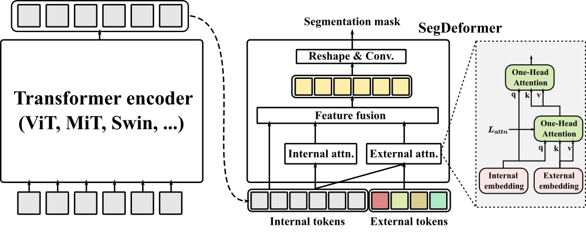

# A Transformer-based Decoder for Semantic Segmentation with Multi-level Context Mining

Official implementation of the paper [A Transformer-based Decoder for Semantic Segmentation with Multi-level Context Mining](https://www.ecva.net/papers/eccv_2022/papers_ECCV/html/383_ECCV_2022_paper.php), 

by Bowen Shi*, Dongsheng Jiang*, Xiaopeng Zhang, Han Li, Wenrui Dai, Junni Zou, Hongkai Xiong, Qi Tian. 


[[Paper](https://www.ecva.net/papers/eccv_2022/papers_ECCV/papers/136880617.pdf)] [[Appendix](https://www.ecva.net/papers/eccv_2022/papers_ECCV/papers/136880617-supp.pdf)]


<div  align="center">

</div>

## Installation

Our code is based on [MMSegmentation](https://github.com/open-mmlab/mmsegmentation/). For install and data preparation, please refer to the guidelines in [MMSegmentation](https://github.com/open-mmlab/mmsegmentation/).

## Training 
Example: train SegFormer-B1 + SegDeformer on ADE20K:

python start_local_train.py --config_file segformer/segformer_mit-b1_512x512_160k_ade20k_segdeformer3.py

## Results

### ADE20K

| Method| Backbone | Crop Size | Lr schd | mIoU  | config  | log |
| ---------------- | -------- | --------- | -----| ----- | --------- | --------- 
| SegFormer-B1 | MiT-B1 | 512x512   | 160000 |40.97 | -   | -  |
| SegFormer-B1 + SegDeformer | MiT-B1 | 512x512   | 160000 |44.12 | [config](https://github.com/lygsbw/segdeformer/blob/main/configs/segformer/segformer_mit-b1_512x512_160k_ade20k_segdeformer3.py)   | [log]   |
| SegFormer-B2 | MiT-B2 | 512x512   | 160000 |45.58 | -  | -  |
| SegFormer-B2 + SegDeformer | MiT-B2 | 512x512   | 160000 | 47.34 | [config](https://github.com/lygsbw/segdeformer/blob/main/configs/segformer/segformer_mit-b2_512x512_160k_ade20k_segdeformer3.py)    | [log]   |
| SegFormer-B5 | MiT-B5 | 512x512   | 160000 |49.13 | -  | -  |
| SegFormer-B5 + SegDeformer | MiT-B5 | 512x512   | 160000 | 50.34 | [config](https://github.com/lygsbw/segdeformer/blob/main/configs/segformer/segformer_mit-b5_512x512_160k_ade20k_segdeformer3.py)   | [log]    |

Note:

- We adapt our code to the latest version of MMSegmentation (v0.29.1), while the pretrained model we used is still **the old version provided by MMSegmentation** to keep consistent with our paper. Details can be found in this [link](https://github.com/open-mmlab/mmsegmentation/pull/1705).
- The performance is sensitive to the seed values used, so the results might fluctuate.

## Citation
If you find this repository/work helpful in your research, welcome to cite the paper.
```
@inproceedings{segdeformer,
    title={A Transformer-based Decoder for Semantic Segmentation with Multi-level Context Mining}, 
    author={Bowen Shi and Dongsheng Jiang and Xiaopeng Zhang and Han Li and Wenrui Dai and Junni Zou and Hongkai Xiong and Qi Tian},
    journal={European Conference on Computer Vision},
    year={2022}
}
